# Almanasa ERD

Generated from Laravel migrations.

```mermaid
erDiagram
    users {
        bigint id PK
        string name
        string email UK
        timestamp email_verified_at
        string password
    }

    tenants {
        bigint id PK
        bigint owner_user_id FK
        string name
        string slug UK
        string type
        string status
        string domain UK
        json settings
    }

    tenant_users {
        bigint id PK
        bigint tenant_id FK
        bigint user_id FK
        string role
        string status
        timestamp joined_at
    }

    education_stages {
        bigint id PK
        string name
        string slug UK
        integer sort_order
        boolean is_active
    }

    grades {
        bigint id PK
        bigint education_stage_id FK
        string name
        string slug UK
        integer sort_order
        boolean is_active
    }

    subjects {
        bigint id PK
        string name
        string slug UK
        text description
        string icon
        string image
        boolean is_active
    }

    education_tracks {
        bigint id PK
        string name
        string slug UK
        integer sort_order
        boolean is_active
    }

    grade_subjects {
        bigint id PK
        bigint grade_id FK
        bigint subject_id FK
        bigint education_track_id FK
        boolean is_active
    }

    tenant_grade_subjects {
        bigint id PK
        bigint tenant_id FK
        bigint grade_subject_id FK
        boolean is_active
    }

    teacher_grade_subject_assignments {
        bigint id PK
        bigint tenant_id FK
        bigint tenant_user_id FK
        bigint tenant_grade_subject_id FK
        boolean is_active
    }

    academic_years {
        bigint id PK
        bigint tenant_id FK
        string name
        date starts_at
        date ends_at
        boolean is_current
        string status
    }

    terms {
        bigint id PK
        bigint academic_year_id FK
        string name
        integer sort_order
        date starts_at
        date ends_at
        boolean is_active
    }

    courses {
        bigint id PK
        bigint tenant_id FK
        bigint teacher_grade_subject_assignment_id FK
        bigint academic_year_id FK
        bigint term_id FK
        string title
        string slug
        decimal price
        string currency
        string status
        boolean is_featured
        boolean is_free
    }

    course_sections {
        bigint id PK
        bigint course_id FK
        bigint parent_id FK
        string title
        integer sort_order
        boolean is_published
    }

    lessons {
        bigint id PK
        bigint course_id FK
        bigint course_section_id FK
        string title
        string slug
        integer sort_order
        boolean is_free
        boolean is_preview
        boolean is_published
    }

    lesson_contents {
        bigint id PK
        bigint lesson_id FK
        string type
        string title
        integer sort_order
        boolean is_required
        boolean is_preview
        string contentable_type
        bigint contentable_id
    }

    videos {
        bigint id PK
        bigint tenant_id FK
        bigint lesson_content_id FK
        bigint uploaded_by FK
        string provider
        string provider_video_id
        text video_url
        integer duration_seconds
        string processing_status
        string visibility
    }

    resources {
        bigint id PK
        bigint tenant_id FK
        string resourceable_type
        bigint resourceable_id
        bigint uploaded_by FK
        string title
        string file_path
        string disk
        string mime_type
        boolean is_downloadable
    }

    student_academic_profiles {
        bigint id PK
        bigint tenant_id FK
        bigint student_id FK
        bigint academic_year_id FK
        bigint grade_id FK
        string school_name
    }

    assessments {
        bigint id PK
        bigint tenant_id FK
        bigint course_id FK
        bigint lesson_id FK
        string type
        string title
        integer duration_minutes
        decimal total_score
        decimal passing_score
        boolean is_published
    }

    questions {
        bigint id PK
        bigint tenant_id FK
        bigint created_by FK
        string type
        text text
        string difficulty
        decimal default_score
        string topic
        string status
    }

    question_options {
        bigint id PK
        bigint question_id FK
        text text
        boolean is_correct
        integer sort_order
    }

    assessment_questions {
        bigint id PK
        bigint assessment_id FK
        bigint question_id FK
        decimal score
        integer sort_order
    }

    assessment_attempts {
        bigint id PK
        bigint tenant_id FK
        bigint assessment_id FK
        bigint student_id FK
        integer attempt_number
        decimal score
        decimal percentage
        boolean is_passed
        string status
    }

    attempt_answers {
        bigint id PK
        bigint assessment_attempt_id FK
        bigint question_id FK
        json answer
        boolean is_correct
        decimal score
        bigint graded_by FK
    }

    plans {
        bigint id PK
        bigint tenant_id FK
        string name
        string type
        decimal price
        string currency
        string duration_type
        integer duration_value
        boolean is_active
    }

    plan_items {
        bigint id PK
        bigint plan_id FK
        string item_type
        bigint item_id
    }

    orders {
        bigint id PK
        bigint tenant_id FK
        bigint student_id FK
        string order_number UK
        decimal subtotal
        decimal discount
        decimal tax
        decimal total
        string currency
        string status
        string payment_status
    }

    order_items {
        bigint id PK
        bigint order_id FK
        string item_type
        bigint item_id
        string title
        decimal unit_price
        integer quantity
        decimal total
    }

    payments {
        bigint id PK
        bigint tenant_id FK
        bigint order_id FK
        bigint student_id FK
        string method
        decimal amount
        string currency
        string status
        string transaction_reference
        string provider_reference
    }

    payment_proofs {
        bigint id PK
        bigint payment_id FK
        string sender_phone
        string transfer_reference
        string receipt_path
        string status
        bigint reviewed_by FK
    }

    subscriptions {
        bigint id PK
        bigint tenant_id FK
        bigint student_id FK
        bigint plan_id FK
        bigint order_id FK
        timestamp starts_at
        timestamp ends_at
        string status
        boolean auto_renew
    }

    enrollments {
        bigint id PK
        bigint tenant_id FK
        bigint student_id FK
        bigint course_id FK
        bigint subscription_id FK
        bigint order_item_id FK
        timestamp starts_at
        timestamp expires_at
        string status
        string access_type
        bigint granted_by FK
    }

    carts {
        bigint id PK
        bigint tenant_id FK
        bigint student_id FK
        string status
    }

    cart_items {
        bigint id PK
        bigint cart_id FK
        string item_type
        bigint item_id
        decimal unit_price
        integer quantity
    }

    lesson_progress {
        bigint id PK
        bigint tenant_id FK
        bigint student_id FK
        bigint lesson_id FK
        string status
    }

    video_progress {
        bigint id PK
        bigint tenant_id FK
        bigint student_id FK
        bigint video_id FK
        bigint lesson_content_id FK
        integer watched_seconds
        integer last_position_seconds
        decimal watch_percentage
        string status
    }

    users ||--o{ tenants : owns
    users ||--o{ tenant_users : belongs_to
    tenants ||--o{ tenant_users : has_members

    education_stages ||--o{ grades : has
    grades ||--o{ grade_subjects : offers
    subjects ||--o{ grade_subjects : included_in
    education_tracks ||--o{ grade_subjects : tracks

    tenants ||--o{ tenant_grade_subjects : offers
    grade_subjects ||--o{ tenant_grade_subjects : available_as
    tenants ||--o{ teacher_grade_subject_assignments : has
    tenant_users ||--o{ teacher_grade_subject_assignments : assigned
    tenant_grade_subjects ||--o{ teacher_grade_subject_assignments : assigned_to

    tenants ||--o{ academic_years : has
    academic_years ||--o{ terms : has

    tenants ||--o{ courses : owns
    teacher_grade_subject_assignments ||--o{ courses : teaches
    academic_years ||--o{ courses : schedules
    terms ||--o{ courses : includes
    courses ||--o{ course_sections : contains
    course_sections ||--o{ course_sections : parent_of
    courses ||--o{ lessons : contains
    course_sections ||--o{ lessons : groups
    lessons ||--o{ lesson_contents : contains
    lesson_contents ||--o{ videos : attaches
    tenants ||--o{ videos : owns
    users ||--o{ videos : uploads
    tenants ||--o{ resources : owns
    users ||--o{ resources : uploads

    tenants ||--o{ student_academic_profiles : has
    users ||--o{ student_academic_profiles : student
    academic_years ||--o{ student_academic_profiles : year
    grades ||--o{ student_academic_profiles : grade

    tenants ||--o{ assessments : owns
    courses ||--o{ assessments : has
    lessons ||--o{ assessments : has
    tenants ||--o{ questions : owns
    users ||--o{ questions : creates
    questions ||--o{ question_options : has
    assessments ||--o{ assessment_questions : uses
    questions ||--o{ assessment_questions : used_by
    assessments ||--o{ assessment_attempts : has
    tenants ||--o{ assessment_attempts : owns
    users ||--o{ assessment_attempts : attempts
    assessment_attempts ||--o{ attempt_answers : has
    questions ||--o{ attempt_answers : answered
    users ||--o{ attempt_answers : grades

    tenants ||--o{ plans : owns
    plans ||--o{ plan_items : contains
    tenants ||--o{ orders : owns
    users ||--o{ orders : places
    orders ||--o{ order_items : contains
    tenants ||--o{ payments : owns
    orders ||--o{ payments : paid_by
    users ||--o{ payments : pays
    payments ||--o{ payment_proofs : has
    users ||--o{ payment_proofs : reviews
    tenants ||--o{ subscriptions : owns
    users ||--o{ subscriptions : subscribes
    plans ||--o{ subscriptions : grants
    orders ||--o{ subscriptions : creates
    tenants ||--o{ enrollments : owns
    users ||--o{ enrollments : enrolls
    courses ||--o{ enrollments : grants
    subscriptions ||--o{ enrollments : covers
    order_items ||--o{ enrollments : purchased_by
    users ||--o{ enrollments : grants
    tenants ||--o{ carts : owns
    users ||--o{ carts : shops
    carts ||--o{ cart_items : contains
    tenants ||--o{ lesson_progress : owns
    users ||--o{ lesson_progress : tracks
    lessons ||--o{ lesson_progress : progressed
    tenants ||--o{ video_progress : owns
    users ||--o{ video_progress : watches
    videos ||--o{ video_progress : tracked
    lesson_contents ||--o{ video_progress : tracked
```

## Polymorphic Relations

Mermaid ER diagrams cannot fully enforce Laravel morph relationships, so these are represented as `*_type` and `*_id` columns:

- `lesson_contents.contentable_type/contentable_id`
- `resources.resourceable_type/resourceable_id`
- `plan_items.item_type/item_id`
- `order_items.item_type/item_id`
- `cart_items.item_type/item_id`

