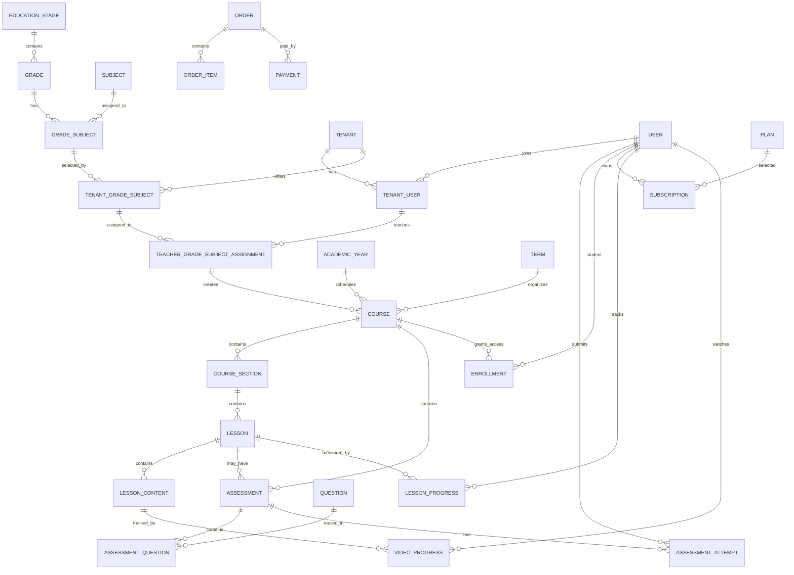
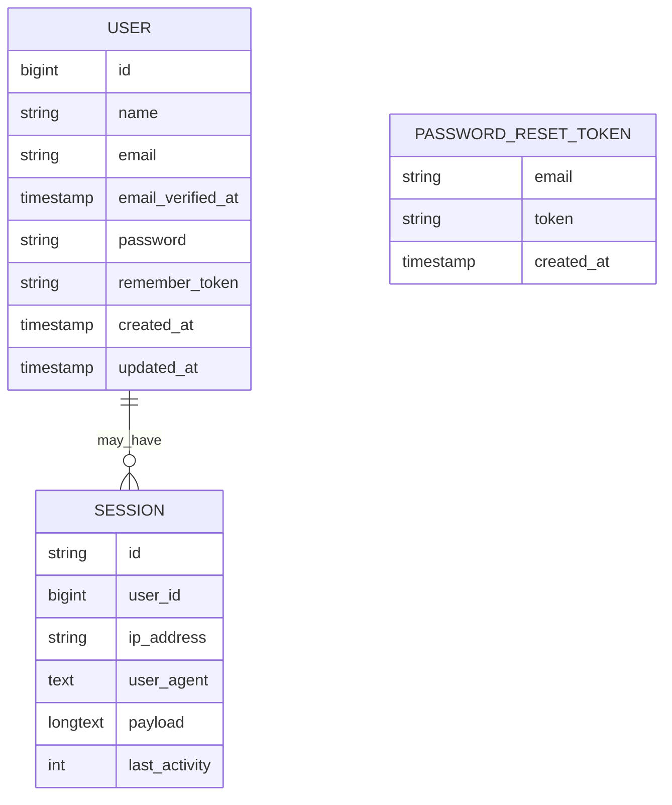

# Project Business Documentation

## Purpose

This document describes the intended business model for this Laravel multi-tenant educational SaaS platform and the current implementation state in this repository.

It is intended for developers and AI coding agents before they modify the project.

## Current Implementation Summary

The current repository is a fresh Laravel 12 application with a small amount of installed infrastructure. The education SaaS domain described below is not implemented yet.

Implemented application files inspected:

- Model: `App\Models\User`
- Migrations:
  - `users`
  - `password_reset_tokens`
  - `sessions`
  - Laravel cache and job tables
- Routes:
  - `GET /` renders the default `welcome` view
- Configuration:
  - Standard Laravel configuration files
- Tests:
  - Default example feature and unit tests
- Installed packages include Laravel Sanctum, Filament 4, Filament Apex Charts, a Filament language switcher, and Spatie Translatable.

No project-specific models, migrations, enums, policies, gates, middleware, services, actions, jobs, events, listeners, notifications, controllers, form requests, Filament resources, tenant logic, payment logic, course logic, or assessment logic currently exist.

## Implemented Functionality

### Users

The only domain model currently implemented is `App\Models\User`.

Actual `users` table fields:

- `id`
- `name`
- `email`
- `email_verified_at`
- `password`
- `remember_token`
- `created_at`
- `updated_at`

Actual `User` model behavior:

- Fillable attributes are `name`, `email`, and `password`.
- Hidden attributes are `password` and `remember_token`.
- Casts:
  - `email_verified_at` as `datetime`
  - `password` as `hashed`
- Uses Laravel authentication, factories, and notifications.

There are no implemented user roles, tenant memberships, student profiles, teacher profiles, parent accounts, or support roles.

### Authentication and Sessions

Laravel's default user, password reset token, and session tables are present. There is no project-specific registration workflow, phone OTP workflow, tenant login workflow, or role-based access workflow.

### Queues and Cache

Default Laravel queue, failed job, job batch, cache, cache lock tables are present. No project-specific jobs or queued workflows currently exist.

## Partially Implemented Functionality

Filament and Sanctum are installed in `composer.json`, but no Filament panels, resources, pages, policies, API tokens, or API endpoints are implemented in the application code.

## Planned Functionality

The following sections describe the intended business model. Unless explicitly listed under "Implemented Functionality", these structures are planned and not yet implemented in code.

## Out-of-Scope Features

This platform does not support live educational sessions.

Do not add or document implementation for:

- Live classes
- Live educational sessions
- Zoom
- Google Meet
- Agora
- Zego
- Meeting links
- Meeting passwords
- Live-session attendance
- Video conference rooms
- Real-time virtual classrooms

The learning model is based on recorded and uploaded educational content.

## Project Purpose

The intended project is a multi-tenant educational SaaS platform.

It should allow:

- Academies to create their own educational platforms.
- Standalone teachers to create their own teacher platforms.
- Teachers to publish recorded courses.
- Students to subscribe to courses or packages.
- Students to watch recorded lessons.
- Students to download allowed resources.
- Students to complete homework, quizzes, and exams.
- Students to track learning progress.
- Academy owners and teachers to monitor student performance.
- Tenants to receive and verify payments.

The same architecture must support academy tenants and standalone teacher tenants. The project should not create separate duplicate domains such as `AcademyCourse`, `StandaloneTeacherCourse`, `AcademyLesson`, `TeacherLesson`, `AcademySubject`, or `TeacherSubject`.

## Tenant Types

Tenant functionality is not implemented yet. No tenant table, tenant type enum, or tenant type column exists.

Planned tenant types:

- Academy
- Standalone teacher platform

### Academy Tenant

An academy tenant should support:

- One owner
- Multiple administrators
- Multiple teachers
- Multiple students
- Multiple education offerings
- Multiple grade-subject combinations
- Multiple courses
- Multiple subscription plans
- Multiple payment methods

Example:

Academy A offers Secondary 1 Mathematics, Secondary 1 Physics, and Secondary 2 Mathematics. It has an owner, administrators, several teachers, and students who enroll in recorded courses.

### Standalone Teacher Tenant

A standalone teacher tenant should use the same tenant architecture as an academy.

It normally has:

- One main teacher as owner
- Optional staff or administrators
- Multiple grades
- Multiple subjects
- Multiple recorded courses
- Multiple students
- Subscription plans and payments

Example:

Mr Ahmed's platform offers Secondary 1 Mathematics, Secondary 2 Mathematics, and Secondary 3 Mathematics. Mr Ahmed is the tenant owner and may also be the teacher assigned to these tenant grade-subject offerings.

Automatic assignment of the standalone teacher owner to offered grade-subjects is not implemented.

## Main Actors

No roles or permissions are implemented yet. The following actors are planned.

### Super Admin

Planned responsibilities:

- Manage all tenants.
- Approve, activate, suspend, or delete tenants.
- Manage global education catalog data.
- Manage SaaS subscription plans.
- Access cross-tenant reports.
- Manage global settings.
- Manage tenant limits.

### Tenant Owner

Planned responsibilities:

- Manage tenant information.
- Manage tenant administrators.
- Manage teachers.
- Manage students.
- Select grade-subject offerings.
- Assign teachers to grade-subject offerings.
- Manage courses.
- Manage subscription plans.
- Review payments.
- Access reports.

### Academy Admin

Planned responsibilities:

- Manage teachers.
- Manage students.
- Manage courses.
- Review content.
- Review manual payments.
- Access tenant reports.

### Teacher

Planned responsibilities:

- Access assigned grade-subjects.
- Create courses when authorized.
- Create course sections.
- Create lessons.
- Upload recorded videos.
- Upload files and PDFs.
- Create homework, quizzes, and exams.
- View enrolled students.
- View student progress.
- Participate in course chat when enabled.

### Student

Planned responsibilities:

- Register and complete an academic profile.
- Browse available grades and subjects.
- Select a teacher course.
- Purchase a course or package.
- Access enrolled courses.
- Watch recorded videos.
- Complete assessments.
- View scores and progress.
- Participate in authorized course chats.
- Submit course reviews when allowed.

### Parent

Not implemented.

Possible planned responsibilities:

- Link to one or more students.
- View student reports.
- View progress.
- Receive notifications.

Attendance should only refer to recorded-content progress if implemented. Live-session attendance is out of scope.

### Support User

Not implemented.

Possible planned responsibilities:

- Handle support tickets.
- Assist students and tenants.
- View limited tenant information according to permissions.

## Global Education Catalog

The global education catalog is planned but not implemented.

Expected global tables:

- `education_stages`
- `grades`
- `subjects`
- `grade_subjects`

These tables should not contain `tenant_id`.

### Education Stages

Planned meaning: a major school stage such as Primary, Preparatory, or Secondary.

Expected relationship:

```text
EducationStage
    -> Grades
```

Possible fields:

- `id`
- `name`
- `slug`
- `sort_order`
- `is_active`
- `created_at`
- `updated_at`

### Grades

Planned meaning: a grade belongs to exactly one education stage.

Examples:

- Primary 1
- Primary 2
- Preparatory 1
- Secondary 1
- Secondary 2
- Secondary 3

Possible fields:

- `id`
- `education_stage_id`
- `name`
- `slug`
- `sort_order`
- `is_active`
- `created_at`
- `updated_at`

Important planned rule: a grade must belong to exactly one education stage.

### Subjects

Planned meaning: subjects are global educational concepts and do not directly belong to tenants.

Examples:

- Mathematics
- Physics
- Chemistry
- Arabic
- English
- Biology
- Geography
- History

Possible fields:

- `id`
- `name`
- `slug`
- `description`
- `icon`
- `image`
- `is_active`
- `created_at`
- `updated_at`

### Grade Subjects

Planned meaning: `grade_subjects` connects a specific global grade to a specific global subject.

Examples:

- Secondary 1 + Mathematics
- Secondary 1 + Physics
- Secondary 2 + Mathematics
- Primary 4 + Arabic

Expected relationship:

```text
Grade + Subject
    -> GradeSubject
```

Possible fields:

- `id`
- `grade_id`
- `subject_id`
- `education_track_id`
- `is_active`
- `created_at`
- `updated_at`

A grade-subject combination should be unique. If education tracks are implemented, uniqueness may include the track.

Subjects must not be described as direct child records of grades. `grade_subjects` is the pivot or domain entity connecting them.

## Education Tracks

Education tracks are not implemented.

Possible examples:

- General
- Scientific
- Literary

Possible structure:

- `education_tracks`
- `grade_subjects.education_track_id`

Open decision: whether tracks are global, attached to grades, or configured separately.

## Tenant Users

Tenant membership is not implemented.

Planned concept:

```text
Tenant + User
    -> TenantUser
```

Expected table name: `tenant_users`, unless the implementation later chooses another name such as `memberships`.

A tenant membership should connect:

- User
- Tenant
- Tenant-specific role
- Membership status

Possible tenant roles:

- `owner`
- `admin`
- `teacher`
- `student`
- `support`

Important planned rule: a user may have a different role in each tenant.

Examples:

- A user may be a teacher in Academy A.
- The same user may be the owner of a standalone teacher tenant.
- A user may be an administrator in Academy B.

## Tenant Educational Offerings

Tenant offerings are not implemented.

A tenant should not own the global education catalog. Instead, each tenant selects which global grade-subject combinations it offers.

Expected table: `tenant_grade_subjects`.

Planned meaning:

```text
Tenant + GradeSubject
    -> TenantGradeSubject
```

This means: "This academy or standalone teacher platform offers this global grade-subject."

Possible fields:

- `id`
- `tenant_id`
- `grade_subject_id`
- `is_active`
- `created_at`
- `updated_at`

Planned rules:

- A tenant grade-subject must reference a global grade-subject.
- A tenant grade-subject must be unique inside the tenant.
- A tenant may add an offering before assigning any teacher.
- Disabling an offering should not automatically delete historical courses, enrollments, orders, or progress.
- Tenant grade-subjects represent what the tenant offers.
- Tenant grade-subjects do not represent which teacher teaches the offering.

Academy example:

- Academy A offers Secondary 1 Mathematics.
- Academy A offers Secondary 1 Physics.
- Academy A offers Secondary 2 Mathematics.

Standalone teacher example:

- Mr Ahmed's platform offers Secondary 1 Mathematics.
- Mr Ahmed's platform offers Secondary 2 Mathematics.
- Mr Ahmed's platform offers Secondary 3 Mathematics.

## Teacher Grade-Subject Assignments

Teacher assignment is not implemented.

Expected table: `teacher_grade_subject_assignments`.

Planned meaning:

```text
TenantUser + TenantGradeSubject
    -> TeacherGradeSubjectAssignment
```

This means: "This teacher teaches this grade-subject inside this tenant."

Possible fields:

- `id`
- `tenant_user_id`
- `tenant_grade_subject_id`
- `tenant_id`
- `is_active`
- `created_at`
- `updated_at`

Planned rules:

- The tenant user must belong to the same tenant as the tenant grade-subject.
- The tenant user must have a teacher role or equivalent permission.
- The same teacher assignment should not be duplicated.
- Deactivating an assignment should not automatically delete historical courses.
- Teacher assignments describe teaching eligibility or assignment.
- Teacher assignments do not directly own lessons.
- Lessons belong to courses.

Many-to-many academy example:

- Secondary 1 Mathematics in Academy A may be taught by Mr Ahmed, Mr Mohamed, and Mr Ali.
- Mr Ahmed may teach Secondary 1 Mathematics, Secondary 2 Mathematics, and Secondary 3 Mathematics.

## Separation of Core Concepts

These concepts must stay separate in the implementation.

### Global Grade-Subject

Example: Secondary 1 + Mathematics.

Meaning: this subject exists globally for this grade.

### Tenant Grade-Subject

Example: Academy A offers Secondary 1 Mathematics.

Meaning: the tenant includes this grade-subject in its educational offerings.

### Teacher Grade-Subject Assignment

Example: Mr Ahmed teaches Academy A's Secondary 1 Mathematics offering.

Meaning: a specific teacher is assigned to teach the tenant offering.

### Course

Example: Secondary 1 Mathematics with Mr Ahmed, First Term, 2026/2027.

Meaning: a specific educational and commercial product that students can access.

## Academic Years

Academic years are not implemented.

An academic year is different from a grade.

Examples:

- 2026/2027
- 2027/2028

Possible fields:

- `id`
- `name`
- `starts_at`
- `ends_at`
- `is_current`
- `status`
- `created_at`
- `updated_at`

Open decision: whether academic years are global or tenant-specific.

Important distinction:

- Education stage: Secondary
- Grade: Secondary 1
- Academic year: 2026/2027
- Term: First Term

## Terms

Terms are not implemented.

Possible terms:

- First Term
- Second Term

Possible fields:

- `id`
- `academic_year_id`
- `name`
- `sort_order`
- `starts_at`
- `ends_at`
- `is_active`
- `created_at`
- `updated_at`

Open decisions:

- Whether terms are global or tenant-specific.
- Whether terms attach to academic years.
- Whether terms use database tables or enums.
- Whether full-year courses use `null` term or a special full-year value.

## Courses

Courses are not implemented.

A course is the main teaching and commercial unit. It represents a specific teacher teaching a specific tenant grade-subject in a specific academic context.

Example: "Secondary 1 Mathematics with Mr Ahmed, First Term, 2026/2027".

Expected relationship:

```text
TeacherGradeSubjectAssignment
    -> Courses
```

A course should belong to:

- Tenant
- Teacher grade-subject assignment
- Academic year
- Term, when applicable

Possible fields:

- `id`
- `tenant_id`
- `teacher_grade_subject_assignment_id`
- `academic_year_id`
- `term_id`
- `title`
- `slug`
- `description`
- `learning_outcomes`
- `thumbnail`
- `intro_video`
- `price`
- `currency`
- `status`
- `is_featured`
- `is_free`
- `published_at`
- `available_from`
- `available_until`
- `created_at`
- `updated_at`

Possible course statuses:

- `draft`
- `pending_review`
- `published`
- `archived`
- `suspended`

Open decisions:

- Who can create courses.
- Who can publish courses.
- Whether academy approval is required.
- Whether teachers can edit published courses.
- Whether archived courses remain accessible to enrolled students.

One teacher assignment may create several courses, such as first term, second term, final revision, summer course, question bank, and exam preparation courses. Lessons must not belong directly to teacher assignments.

## Course Sections

Course sections are not implemented.

Expected table: `course_sections`.

Possible fields:

- `id`
- `course_id`
- `parent_id`
- `title`
- `description`
- `sort_order`
- `is_published`
- `created_at`
- `updated_at`

Expected hierarchy:

```text
Course
    -> CourseSections
```

If nested sections are implemented, `parent_id` should represent section nesting.

## Lessons

Lessons are not implemented.

Expected hierarchy:

```text
Course
    -> CourseSection
        -> Lesson
```

Lessons must not connect directly to `tenant_grade_subjects` or `teacher_grade_subject_assignments`.

Possible fields:

- `id`
- `course_section_id`
- `course_id`
- `title`
- `slug`
- `description`
- `sort_order`
- `is_free`
- `is_preview`
- `is_published`
- `available_at`
- `estimated_duration`
- `completion_percentage_required`
- `created_at`
- `updated_at`

Open decision: whether lessons store both `course_id` and `course_section_id`. If both exist, the implementation must enforce consistency.

## Lesson Content

Lesson content is not implemented.

A lesson may contain multiple ordered content items.

Expected hierarchy:

```text
Lesson
    -> LessonContents
```

Possible content types:

- Recorded video
- Additional recorded video
- PDF summary
- Text content
- Image
- Attachment
- Homework
- Quiz
- External link

Live sessions must not be included.

Possible fields:

- `id`
- `lesson_id`
- `type`
- `title`
- `sort_order`
- `is_required`
- `is_preview`
- `available_at`
- `contentable_type`
- `contentable_id`
- `created_at`
- `updated_at`

Open decisions:

- Whether to use a single polymorphic `lesson_contents` table.
- Whether to use separate lesson video, file, assignment, and quiz relationships.
- Whether to use a JSON content structure.
- Whether students must complete content sequentially.

## Recorded Videos

Recorded video handling is not implemented.

Possible providers:

- Bunny Stream
- Vimeo
- YouTube
- Local storage
- Another provider

Possible fields:

- `id`
- `tenant_id`
- `lesson_content_id`
- `provider`
- `provider_video_id`
- `video_url`
- `duration_seconds`
- `thumbnail`
- `processing_status`
- `visibility`
- `uploaded_by`
- `created_at`
- `updated_at`

Open decisions:

- How teachers upload videos.
- Whether uploads go directly to a video provider.
- Whether Laravel receives the whole video file.
- How processing status is updated.
- How video IDs are stored.
- How protected playback URLs are generated.
- Whether signed URLs or tokens are used.
- Whether free preview videos exist.
- Whether students can download videos.
- Whether tenant upload limits exist.

Do not store large video files directly on a standard Laravel application server unless that becomes the explicit implementation.

## Video Progress

Video progress is not implemented.

Possible tables:

- `video_progress`
- `lesson_content_progress`

Possible fields:

- `tenant_id`
- `student_id`
- `video_id`
- `lesson_content_id`
- `watched_seconds`
- `last_position_seconds`
- `watch_percentage`
- `started_at`
- `completed_at`
- `last_watched_at`
- `status`
- `created_at`
- `updated_at`

Possible statuses:

- `not_started`
- `in_progress`
- `completed`

Planned rules:

- Completion should use actual watch progress.
- Completion should not depend only on reaching the final second.
- Repeated playback of the same seconds should not incorrectly increase unique watch progress.
- Progress must be scoped to the correct student and tenant.
- Last playback position should allow students to continue watching.
- Progress updates should be validated server-side.
- Students must have active access before progress is recorded.
- Preview videos may have different access rules.

Advanced watch validation is planned and not implemented.

## Files and Educational Resources

File and resource handling is not implemented.

Possible resource table: `resources`.

Possible fields:

- `id`
- `tenant_id`
- `resourceable_type`
- `resourceable_id`
- `title`
- `file_path`
- `disk`
- `mime_type`
- `file_size`
- `is_downloadable`
- `uploaded_by`
- `created_at`
- `updated_at`

Open decisions:

- Supported file types.
- Maximum file sizes.
- Whether files are publicly accessible.
- Whether files use signed temporary URLs.
- Whether download permission depends on enrollment.
- Whether downloadable content is configurable.

## Assessments

Assessments are not implemented.

Possible assessment types:

- Homework
- Quiz
- Practice test
- Lesson exam
- Course exam
- Final exam

Expected shared assessment tables may include:

- `assessments`
- `questions`
- `question_options`
- `assessment_questions`
- `assessment_attempts`
- `attempt_answers`

### Assessment Fields

Possible fields:

- `id`
- `tenant_id`
- `course_id`
- `lesson_id`
- `type`
- `title`
- `description`
- `instructions`
- `duration_minutes`
- `total_score`
- `passing_score`
- `max_attempts`
- `starts_at`
- `ends_at`
- `shuffle_questions`
- `shuffle_options`
- `show_result_immediately`
- `show_correct_answers`
- `show_explanations`
- `allow_retry`
- `is_published`
- `created_at`
- `updated_at`

### Questions and Explanations

Possible question types:

- Single choice
- Multiple choice
- True or false
- Text answer
- Numeric answer
- Essay
- Matching

Questions may contain:

- Text
- Image
- Explanation text
- Explanation image
- Difficulty
- Default score
- Topic
- Created by
- Publishing status

Question explanations may be text, image, or both. When students can view explanations is not decided.

Possible visibility points:

- Immediately after answering.
- After submission.
- After the assessment end date.
- Only when enabled by the teacher.

Correct answers must never be exposed to unauthorized students before submission.

### Assessment Attempts

Possible fields:

- `id`
- `tenant_id`
- `assessment_id`
- `student_id`
- `attempt_number`
- `started_at`
- `submitted_at`
- `expires_at`
- `time_spent_seconds`
- `score`
- `percentage`
- `is_passed`
- `status`
- `created_at`
- `updated_at`

Possible statuses:

- `in_progress`
- `submitted`
- `graded`
- `expired`
- `cancelled`

Planned rules:

- Attempt limits must be enforced server-side.
- Time limits must be enforced server-side.
- Students must have course access.
- Only published assessments may be started.
- Answers must belong to questions in the assessment.
- Automatic grading applies only to supported question types.
- Essay questions may require manual grading.
- Scores must not be trusted from frontend input.
- Retake rules must follow assessment settings.
- Correct answers and explanations must follow visibility settings.

## Student Registration and Academic Profile

Student-specific registration is not implemented. The only implemented user fields are `name`, `email`, and `password`.

Possible registration information:

- Name
- Phone
- Email
- Password or OTP
- Country
- City
- Education stage
- Grade
- School
- Profile image

Open decisions:

- Whether registration uses phone OTP.
- Whether email verification is required.
- How a student selects their current grade.
- Whether students can change grade.
- Whether grade history is stored.
- Whether school information is optional.
- Whether a student can belong to multiple tenants.

Possible academic profile table: `student_academic_profiles`.

Possible fields:

- `student_id`
- `academic_year_id`
- `grade_id`
- `school_id`
- `created_at`
- `updated_at`

## Enrollments and Course Access

Enrollments are not implemented.

Expected table: `enrollments`.

An enrollment should answer:

- Which student has access?
- Which course can the student access?
- When does access start?
- When does access expire?
- Why was access granted?
- Is access currently active?

Possible fields:

- `id`
- `tenant_id`
- `student_id`
- `course_id`
- `subscription_id`
- `order_item_id`
- `starts_at`
- `expires_at`
- `status`
- `access_type`
- `granted_by`
- `created_at`
- `updated_at`

Possible access types:

- `paid`
- `package`
- `free`
- `trial`
- `gift`
- `admin_granted`

Possible statuses:

- `pending`
- `active`
- `expired`
- `cancelled`
- `suspended`
- `refunded`

Planned rules:

- Protected course content requires an active enrollment.
- Enrollment tenant must match the course tenant.
- Enrollment student must belong to or be authorized for the tenant.
- Expired enrollments must not grant protected access.
- Free preview content may be accessed without enrollment.
- Payment success or approval may create enrollment.
- Refunded or reversed payments may revoke access according to business policy.
- Historical progress should not be deleted when access expires.

The access-checking mechanism is not implemented.

## Subscription Plans

Student educational subscription plans are not implemented.

Possible tables:

- `plans`
- `plan_items`
- `subscriptions`

Possible plan types:

- Monthly subscription
- Term subscription
- Full academic year subscription
- Single course subscription
- Single subject subscription
- All-subject package
- Customized package
- Teacher-specific package

Possible plan fields:

- `id`
- `tenant_id`
- `name`
- `type`
- `description`
- `price`
- `currency`
- `duration_type`
- `duration_value`
- `is_active`
- `created_at`
- `updated_at`

Possible duration types:

- `days`
- `months`
- `term`
- `academic_year`
- `lifetime`

Plan items may include:

- Specific courses
- Specific subjects
- Specific grade-subjects
- Courses from specific teachers
- All courses for a grade
- All subjects for a grade

Open decisions:

- How plan items are represented.
- Whether adding a new course to a plan grants it to existing subscribers.
- How subscription renewal extends or recreates access.
- Whether subscriptions expire automatically at the end of an academic year.

## Cart

Cart functionality is not implemented.

Expected tables:

- `carts`
- `cart_items`

Possible cart item types:

- Course
- Plan
- Subject subscription
- Customized package

Planned rules:

- A cart must not combine products from different tenants unless explicitly supported.
- Prices must be refreshed before checkout.
- Expired or unpublished items should be removed or blocked.
- Duplicate items should be prevented.

## Orders

Orders are not implemented.

Expected tables:

- `orders`
- `order_items`

Possible order fields:

- `id`
- `tenant_id`
- `student_id`
- `order_number`
- `subtotal`
- `discount`
- `tax`
- `total`
- `currency`
- `status`
- `payment_status`
- `billing_name`
- `billing_email`
- `created_at`
- `updated_at`

Possible statuses:

- `pending`
- `awaiting_payment`
- `paid`
- `cancelled`
- `refunded`
- `partially_refunded`
- `failed`

Planned rules:

- Order prices must be calculated server-side.
- Product titles and prices should be copied into order items for historical records.
- Frontend totals must never be trusted.
- Orders must belong to one tenant.
- Paid orders must not be modified without a controlled process.
- Order currency must match tenant or payment configuration.

## Payments

Payments are not implemented.

Possible payment methods:

- Card
- InstaPay
- Vodafone Cash
- Orange Cash
- Etisalat Cash
- Wallet
- Payment code
- Bank transfer
- Manual transfer with payment proof

Possible tables:

- `payments`
- `payment_proofs`
- `payment_transactions`

Possible payment fields:

- `id`
- `tenant_id`
- `order_id`
- `student_id`
- `method`
- `amount`
- `currency`
- `status`
- `transaction_reference`
- `provider_reference`
- `paid_at`
- `metadata`
- `created_at`
- `updated_at`

Possible statuses:

- `pending`
- `awaiting_review`
- `approved`
- `paid`
- `rejected`
- `failed`
- `cancelled`
- `refunded`

### Manual Payment Proof

Manual payment workflow is not implemented.

Planned workflow:

1. Student creates an order.
2. Student selects a manual payment method.
3. Student submits payment proof when required.
4. Payment enters review state.
5. Tenant admin approves or rejects the payment.
6. Approved payment marks the order as paid.
7. Enrollments or subscriptions are created.
8. Rejected payment stores the rejection reason.
9. Student is notified.

Manual payments must not activate enrollment until approved, unless a future implementation explicitly chooses different behavior.

### Online Payment Providers

No online payment provider is implemented.

Open decisions:

- Provider name.
- Payment intent creation.
- Callback or webhook handling.
- Signature verification.
- Idempotency.
- Duplicate webhook protection.
- Successful-payment processing.
- Failed-payment processing.

## Coupons and Discounts

Coupons and discounts are not implemented.

Possible tables:

- `coupons`
- `coupon_usages`

Possible coupon types:

- Fixed discount
- Percentage discount

Possible restrictions:

- Tenant
- Course
- Plan
- Minimum order
- Maximum usage
- Per-student usage
- Start date
- End date

Discount calculations must happen server-side.

## Progress, Reports, and Analytics

Student lesson progress, course progress, analytics, strengths, and weaknesses are not implemented.

Possible progress records:

- Course progress
- Lesson progress
- Lesson content progress
- Video progress
- Assessment progress

Possible lesson progress fields:

- `tenant_id`
- `student_id`
- `lesson_id`
- `status`
- `started_at`
- `completed_at`
- `last_activity_at`
- `created_at`
- `updated_at`

Possible statuses:

- `not_started`
- `in_progress`
- `completed`

Open decisions:

- Whether progress is stored, calculated dynamically, cached, or updated through events or jobs.
- The exact completion rules for lessons and courses.
- Whether required videos, PDFs, homework, and quizzes all affect completion.
- Whether teachers can manually mark completion.
- How strong and weak topics are determined.
- Whether topic statistics are stored.

Do not claim AI-based analysis unless it is explicitly implemented.

## Course Chat

Course chat is not implemented.

Possible tables:

- `chat_rooms`
- `chat_room_members`
- `chat_messages`
- `chat_message_attachments`

Possible message types:

- `text`
- `image`
- `file`
- `audio`
- `system`

Planned rules:

- Only authorized users may access course chat.
- Students normally require active enrollment.
- Chat tenant must match the course tenant.
- Attachments require access validation.
- Cross-tenant chat access is forbidden.
- Teachers may only access chats for assigned courses unless they have broader permission.

## Reviews and Ratings

Reviews and ratings are not implemented.

Possible review targets:

- Course
- Teacher

Possible fields:

- `tenant_id`
- `student_id`
- `course_id`
- `teacher_id`
- `rating`
- `comment`
- `status`
- `created_at`
- `updated_at`

Planned rules:

- Only enrolled students can review.
- A student may review a course once.
- Reviews may require approval.
- Ratings must be within the configured range.
- Average ratings should be calculated from approved reviews.
- Cached averages may be used for performance.

## Notifications

Only Laravel's `Notifiable` trait is present on the `User` model. No project-specific notifications exist.

Possible future notifications:

- New course enrollment
- New lesson published
- Upcoming exam
- Homework result
- Quiz result
- Exam result
- Subscription expiration
- Subscription renewal
- Payment approved
- Payment rejected
- New course chat message
- Course published
- Course archived

Open decisions:

- Channels: database, email, SMS, push, WhatsApp.
- Triggers.
- Recipients.
- Queue usage.
- Read/unread tracking.
- Tenant scoping.

## Support System

Support tickets are not implemented.

Possible tables:

- `support_tickets`
- `support_ticket_messages`

Possible ticket statuses:

- `open`
- `in_progress`
- `waiting_for_user`
- `resolved`
- `closed`

Open decision: tenant isolation and support staff permissions.

## SaaS Plans and Tenant Limits

Platform-level SaaS subscriptions are not implemented.

This business concept is separate from student educational subscriptions.

SaaS subscription:

- Tenant pays the platform owner.

Educational subscription:

- Student pays an academy or standalone teacher tenant.

Possible tenant limits:

- Maximum teachers
- Maximum students
- Maximum courses
- Maximum video storage
- Maximum monthly uploads
- Maximum active grade-subjects
- Maximum administrators

Open decisions:

- How tenant limits are stored.
- How limits are checked.
- What happens when a tenant exceeds a limit.
- Whether tenant plans are enforced in middleware, services, policies, or model rules.

## Tenant Isolation

Tenant isolation is not implemented.

Planned rules:

- All tenant-owned records must be scoped by tenant.
- Global education catalog tables must remain tenant-independent.
- A tenant user must not access data belonging to another tenant.
- A tenant grade-subject must belong to the authenticated tenant.
- A teacher assignment must reference a teacher membership and tenant grade-subject from the same tenant.
- A course must belong to the same tenant as its teacher assignment.
- Course sections must belong to courses in the same tenant.
- Lessons must belong to course sections in the same tenant.
- Enrollments must match the tenant of both student access and course.
- Orders and payments must belong to one tenant.
- Cross-tenant IDs must never be trusted from request input.
- The authenticated tenant context must be resolved server-side.
- Super Admin access must use explicit permissions.
- Global IDs and tenant-owned IDs must not be confused.
- Polymorphic relations must also be tenant-validated.
- Background jobs must preserve tenant context.
- Notifications must not leak data across tenants.
- Storage paths should be tenant-separated when applicable.

Open decision: tenant context resolution method. Possible options include domain, subdomain, URL prefix, authenticated membership, session, middleware, Filament panel, or request header.

## Main Business Workflows

These workflows are planned and not implemented.

### Workflow 1: Create an Academy Tenant

1. Super Admin or user creates the academy tenant.
2. Tenant owner account is created or assigned.
3. Tenant type is set to academy.
4. Tenant status is set.
5. Tenant settings are configured.
6. Tenant owner accesses the tenant dashboard.

### Workflow 2: Create a Standalone Teacher Tenant

1. Teacher creates or receives a tenant.
2. Tenant type is set to standalone teacher.
3. Teacher becomes tenant owner.
4. Teacher receives a tenant teacher membership.
5. Teacher configures the platform.
6. Teacher selects grade-subject offerings.
7. Teacher may be automatically assigned to those offerings.

Automatic assignment is not implemented.

### Workflow 3: Configure Educational Offerings

1. Tenant owner browses global education stages.
2. Tenant owner selects a grade.
3. Tenant owner selects one or more global grade-subjects.
4. `tenant_grade_subjects` records are created.
5. Offerings may be activated or disabled.
6. No teacher is required at this stage.

### Workflow 4: Add Academy Teacher

1. Tenant owner creates or invites a user.
2. User receives a tenant membership.
3. Tenant role is set to teacher.
4. Teacher profile is completed.
5. Teacher receives access according to permissions.

### Workflow 5: Assign Teacher to Grade-Subject

1. Tenant owner selects a tenant grade-subject.
2. Tenant owner selects one or more teachers.
3. Teacher assignment records are created.
4. Same-tenant validation is applied.
5. Assigned teachers can create or manage courses according to permissions.

### Workflow 6: Create a Course

1. Admin or teacher selects a teacher grade-subject assignment.
2. Academic year is selected.
3. Term is selected when applicable.
4. Course information is entered.
5. Price and availability are configured.
6. Course starts as draft.
7. Course content is added.
8. Course is reviewed if required.
9. Course is published.

### Workflow 7: Add Course Content

1. Create course sections or units.
2. Create lessons inside sections.
3. Add ordered lesson content.
4. Upload recorded videos.
5. Upload PDFs and attachments.
6. Add homework.
7. Add quizzes or exams.
8. Configure preview content.
9. Configure publishing and availability.
10. Publish content.

### Workflow 8: Student Registration

1. Student enters registration information.
2. Phone or email is verified if required.
3. Student selects education stage.
4. Student selects current grade.
5. Student completes profile.
6. Student joins or accesses the tenant.

### Workflow 9: Student Browses Courses

Expected browsing flow:

```text
Tenant
    -> Education Stage
    -> Grade
    -> Subject
    -> Available Teachers
    -> Teacher Course
    -> Course Details
```

Actual browsing queries and filters are not implemented.

### Workflow 10: Course or Package Purchase

1. Student selects a course or plan.
2. Item is added to cart if cart exists.
3. Server recalculates price.
4. Order is created.
5. Student chooses payment method.
6. Payment is processed or submitted for review.
7. Order becomes paid after successful payment.
8. Subscription or enrollment is created.
9. Student receives access.
10. Student is notified.

### Workflow 11: Manual Payment Approval

1. Student creates order.
2. Student selects manual payment method.
3. Student uploads proof.
4. Payment status becomes awaiting review.
5. Tenant administrator reviews proof.
6. Administrator approves or rejects.
7. Approval creates access.
8. Rejection records reason.
9. Student is notified.

### Workflow 12: Student Learning Flow

1. Student opens an enrolled course.
2. Student sees sections and lessons.
3. Student opens a lesson.
4. Student watches recorded video.
5. Video progress is saved.
6. Last playback position is saved.
7. Required completion threshold is checked.
8. Student opens files or PDFs.
9. Student completes homework or quiz.
10. Lesson completion is recalculated.
11. Course progress is recalculated.
12. Reports are updated.

### Workflow 13: Assessment Flow

1. Student opens an assessment.
2. Access and attempt limits are checked.
3. Attempt starts.
4. Server stores start and expiry time.
5. Student submits answers.
6. Automatically gradable questions are graded.
7. Manual questions remain pending if applicable.
8. Score is calculated.
9. Attempt is completed.
10. Result visibility rules are applied.
11. Progress and reports are updated.

### Workflow 14: Subscription Expiration

1. Subscription reaches its end date.
2. Subscription status becomes expired.
3. Related enrollment access is updated.
4. Historical progress remains stored.
5. Student receives expiration notification.
6. Renewal may create or extend access.

### Workflow 15: Academic Year Transition

Academic year transition is not implemented.

Possible planned behavior:

- Student educational subscriptions expire.
- Previous course progress remains available historically.
- Student grade may be updated.
- New academic year courses are created.
- Old courses are archived.
- Active access does not automatically transfer unless configured.

Records should not be deleted unless a future explicit retention policy requires it.

## Relationship Diagram

The following ER diagram represents the planned conceptual structure, not the current database.



## Current Database Diagram

The current implemented database is limited to Laravel defaults.



## Implementation Conflicts and Gaps

There are no code conflicts with the intended business model because the business model is not implemented yet.

Important gaps:

- No tenant model or tenant table.
- No tenant type enum or column.
- No tenant membership table.
- No roles or permissions.
- No global education catalog tables.
- No tenant offerings.
- No teacher grade-subject assignments.
- No academic years or terms.
- No courses, sections, lessons, lesson content, videos, files, or progress.
- No assessments or question bank.
- No student academic profile.
- No enrollments, subscriptions, cart, orders, payments, or coupons.
- No payment proof workflow.
- No tenant isolation middleware, policy, or service.
- No Filament resources despite Filament being installed.
- No project-specific notifications, jobs, events, listeners, actions, services, or reports.

## Open Questions

- What exact tenant table name should be used: `tenants` or another name?
- What exact tenant type values should be used for academy and standalone teacher tenants?
- How should tenant context be resolved: domain, subdomain, path prefix, session, Filament panel, authenticated membership, or another mechanism?
- Which roles should be implemented first, and should roles use enums, policies, gates, or a permissions package?
- Should parent and support users be part of the first implementation phase?
- Are academic years global or tenant-specific?
- Are terms global, tenant-specific, attached to academic years, or represented by enums?
- Should education tracks exist, and should `grade_subjects` uniqueness include `education_track_id`?
- Should standalone teacher tenants automatically assign the owner as teacher for selected offerings?
- Should lessons store only `course_section_id`, or both `course_id` and `course_section_id`?
- Should lesson content use a polymorphic table, separate tables, or JSON structure?
- Which recorded video provider should be used?
- Should students ever be allowed to download videos?
- What watch-progress validation strategy is required?
- What file types and size limits should be allowed for educational resources?
- Which assessment question types are required for the first release?
- When should students see correct answers and explanations?
- How should student grade changes across academic years be stored?
- Should cart items be restricted to one tenant per cart?
- Which payment methods and providers are required first?
- What is the exact manual payment proof approval process?
- Should coupons be tenant-scoped, course-scoped, plan-scoped, or all of these?
- Should progress be calculated dynamically or cached?
- Should course chat be implemented?
- Should reviews require approval?
- Which notification channels are required?
- Are platform SaaS plans required in the first release, or only educational subscriptions?
- What tenant limits should be enforced?
- What historical retention policy applies to expired enrollments, archived courses, progress, orders, and payments?
